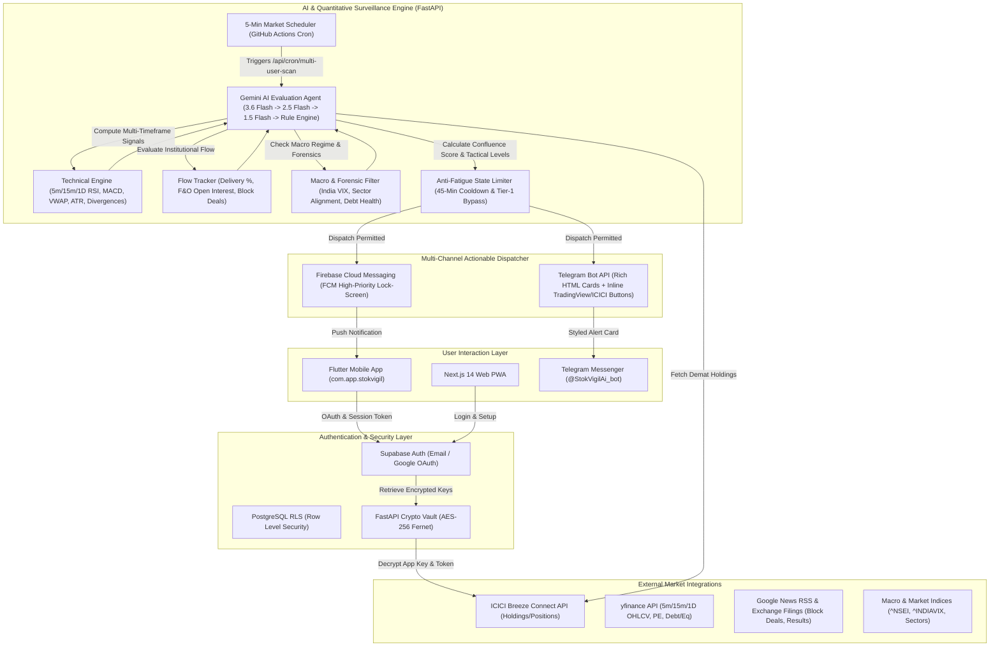

# StokVigil AI — System Architecture Blueprint & Design Specification
**Package Name:** `com.app.stokvigil`  
**Deployment Target:** Google Cloud Run (Free Tier) + Supabase + Firebase FCM + Telegram Bot API  
**Target Platform:** Flutter (Android / iOS) & Next.js 14 PWA  

---

## 1. System Purpose & Pure Intelligence Guarantee
StokVigil AI is an automated, unsleeping market surveillance watchtower operating strictly during Indian Stock Exchange hours (09:15 AM – 03:30 PM IST). 

> **Mandatory Operational Constraint:**  
> The system **does not execute unsolicited automated trades** and **does not issue SEBI-unregistered financial advisory tips** (e.g. "BUY AT 200, TARGET 250"). It fetches real-time data from ICICI Demat accounts (via Breeze API), NSE real-time tick feeds, Google News RSS, and Yahoo Finance, feeds the quantitative data into the Gemini AI Agent Engine, filters out market noise, and dispatches **purely factual data alerts & quantitative confluence setups** (RSI/MACD signals, VWAP, ATR dynamic stops, volume spikes, block/bulk deals, quarterly result deviations, debt shifts) directly to user mobile devices and Telegram chats.

---

## 2. End-to-End System Data Flow



---

## 2.1 AI Agent Evaluation Engine & Quantitative Pillars

Every 5 minutes during Indian market trading hours (`09:15–15:30 IST`), `agent_runner.py` compiles real-time portfolio holdings, multi-timeframe technical momentum, institutional flows, fundamental health, and live news into an evaluation prompt.

### The 4 Factor Weights
1. **Technicals & Multi-Timeframe Confluence (30%)**: 5m/15m/1D RSI, MACD momentum slope, Intraday VWAP distance, 14-period ATR volatility, 20/50/200 EMAs.
2. **Institutional Flow & Derivatives (25%)**: Delivery Volume % ($>50\%$ accumulation), F&O Open Interest (Long Build-up / Short Covering), and Bulk/Block Deal premiums.
3. **Fundamental Valuation & Forensic Health (25%)**: Trailing vs Forward P/E, Debt-to-Equity, Promoter Pledging %, and Operating Margin health.
4. **24h Catalysts & Macro Context (20%)**: Order wins, Quarterly earnings surprises, NIFTY 50 / Sector trend, and India VIX regime.

### Model Execution Fallback Chain
1. **Primary Model**: `gemini-3.6-flash` — High-frequency financial catalyst evaluation with structured JSON output.
2. **First Fallback**: `gemini-2.5-flash` — Low-latency secondary reasoning engine.
3. **Second Fallback**: `gemini-1.5-flash` — Reliable structured payload processor.
4. **Deterministic Rule Engine**: 100% offline algorithm ensuring zero downtime during external API rate limits.

### Supported Alert Categories
- `🟢 ACCUMULATE / BUY WATCH` (Confluence Score $\ge 75$)
- `🔴 PROFIT BOOK / SELL WATCH` (Confluence Score $\le 35$)
- `🟡 TRAILING STOP-LOSS TRIGGER` (Position-aware trigger protecting Demat gains)
- `⚡ Volume Surge` (5m volume $> 2.0\text{x}$ 20 MA with delivery accumulation)
- `📈 Earnings Beat` (Quarterly profit & margin surprise)
- `🚀 Price Breakout` (52-week & technical resistance level breaks)
- `📊 FII / Block Deals` (Institutional block & bulk deals)
- `⚪ Hold / Neutral` (Maintenance watch signals)

---

## 3. Database Architecture (Supabase PostgreSQL + RLS)

### Tables Definition
1. **`profiles`**: Primary user identity, notification endpoints (FCM token, Telegram chat ID), alert sensitivity (`HIGH`, `ALL`, `FII`), and execution mode.
2. **`user_credentials`**: Encrypted ICICI Breeze API credentials (AES-256 Fernet), restricted by RLS to `auth.uid() = user_id`.
3. **`user_watchlists`**: Tracks Demat holdings (auto-synced) and manually added NSE symbols.
4. **`stok_alerts`**: Persistent ledger of evaluated catalysts, tactical trade levels (Entry, Target 1, Target 2, Stop-Loss, R:R), metrics snapshots, and dispatch logs.

---

## 4. Telegram Integration Flow

1. **Bot Setup**: The user opens Telegram and searches for `@StokVigilAi_bot` or clicks the link in the StokVigil app (`t.me/StokVigilAi_bot?start=USER_ID`).
2. **Account Linking**: The bot receives the `/start <USER_ID>` deep link payload via Webhook (`/api/telegram/webhook`).
3. **Registration**: The FastAPI backend maps `chat_id` to the user's `profiles` record in Supabase and sets `telegram_enabled = true`.
4. **Instant Alerts**: During 5-minute scans, high-impact alerts formatted in Telegram HTML (with badges, Demat position context, tactical levels, and inline TradingView/ICICI buttons) are pushed to the user's chat.

---

## 5. Directory Structure in `G:\stokvigil-ai`

```
G:\stokvigil-ai\
├── architecture_blueprint.md
├── .env.example
├── .gitignore
├── README.md
├── supabase/
│   └── migrations/
│       ├── 20260809_init_stokvigil.sql
│       └── 20260822_enhance_stokalerts.sql
├── backend/
│   ├── app/
│   │   ├── __init__.py
│   │   ├── config.py
│   │   ├── vault.py
│   │   ├── technical_engine.py
│   │   ├── flow_tracker.py
│   │   ├── macro_filter.py
│   │   ├── alert_limiter.py
│   │   ├── notifications.py
│   │   ├── agent_runner.py
│   │   └── main.py
│   ├── tests/
│   │   └── test_institutional_engine.py
│   ├── requirements.txt
│   ├── Dockerfile
│   ├── cloudrun.sh
│   └── render.yaml
├── mobile_app/
│   ├── pubspec.yaml
│   ├── assets/
│   │   ├── app_icon.png
│   │   └── app_icon.svg
│   ├── android/
│   └── lib/
│       ├── main.dart
│       ├── config/theme.dart
│       ├── models/models.dart
│       ├── services/
│       │   ├── supabase_service.dart
│       │   ├── api_service.dart
│       │   └── fcm_service.dart
│       ├── widgets/custom_widgets.dart
│       └── screens/
│           ├── auth_screen.dart
│           ├── icici_credentials_screen.dart
│           ├── dashboard_screen.dart
│           ├── alerts_screen.dart
│           ├── notification_settings_screen.dart
│           ├── watchlist_screen.dart
│           └── terms_conditions_modal.dart
├── web_portal/
│   ├── package.json
│   ├── next.config.js
│   ├── tailwind.config.js
│   ├── tsconfig.json
│   └── src/
│       └── app/
│           ├── layout.tsx
│           ├── page.tsx
│           ├── globals.css
│           ├── callback/page.tsx
│           └── api/
│               ├── auth/icici-callback/route.ts
│               └── icici/callback/route.ts
└── .github/
    └── workflows/
        ├── 5min_cron.yml
        └── build_apk.yml
```

---

## 6. REST API & Endpoint Specifications

| Endpoint | Method | Purpose |
| :--- | :---: | :--- |
| `/api/user/credentials` | `POST` | Stores AES-256 encrypted ICICI App Key, Secret Key, and Session Token |
| `/api/user/portfolio` | `GET` | Returns live portfolio holdings, valuation, and P&L breakdown |
| `/api/user/alerts` | `GET` | Retrieves historical catalyst alerts with tactical levels & confidence scores |
| `/api/user/delete-account` | `POST` | Cascades permanent deletion across credentials, watchlists, devices, and auth identity |
| `/api/auth/register-device` | `POST` | Registers FCM notification token and Telegram chat ID |
| `/api/cron/multi-user-scan` | `POST` | Evaluates all active portfolios/watchlists every 5 minutes during NSE hours |
| `/api/telegram/webhook` | `POST` | Telegram bot interactive command handler (`/start`, `/status`, `/help`) |
| `/api/v1/orders/place` | `POST` | Executes BUY / SELL trade orders via ICICI Direct Breeze API |
